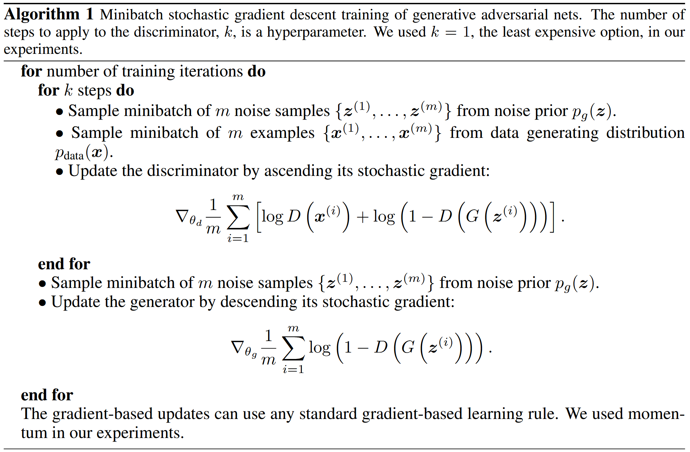
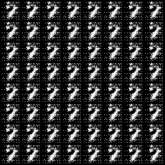

# Deep Convolutional GAN

> **Abstract**: In recent years, supervised learning with convolutional networks (CNNs) has seen huge adoption in computer vision applications. Comparatively, unsupervised learning with CNNs has received less attention. In this work we hope to help bridge the gap between the success of CNNs for supervised learning and unsupervised learning. We introduce a class of CNNs called **deep convolutional generative adversarial networks** (DCGANs), that have certain architectural constraints, and demonstrate that they are a strong candidate for unsupervised learning. Training on various image datasets, we show convincing evidence that our deep convolutional adversarial pair learns a hierarchy of representations from object parts to scenes in both the generator and discriminator. Additionally, we use the learned features for novel tasks - demonstrating their applicability as general image representations.

## Model Architecture

In this implementation, both Generator and Discriminator are defined as Convolutional Neural Network(CNN). I follow the architecture guidelines in [DCGAN](http://arxiv.org/abs/1511.06434) paper:

- Replace any pooling layers with **strided convolutions** (discriminator) and **fractional-strided convolutions** (generator).
- Use **batchnorm** in both the generator and the discriminator.
- Remove fully connected hidden layers for deeper architectures.
- Use **ReLU activation in generator** for all layers except for the output, which uses Tanh.
- Use **LeakyReLU activation in the discriminator** for all layers.

So the Generator and Discriminator overall architectures are as follows:

- *Generator*: affine - [deconv - batchnorm - relu] x 3 - deconv - tanh

- *Discriminator*: conv - leaky relu - [conv - batchnorm - leaky relu] x 3 - affine

## Training Details

| Hyper paramter               | Default Value |
| ---------------------------- | ------------- |
| learning rate                | 0.0002        |
| betas                        | (0.5, 0.999)  |
| batch size                   | 128           |
| latent dimension             | 100           |
| number of epochs             | 200           |
| negative slope of Leaky ReLU | 0.2           |
| k                            | 1             |

I follow the training algorithm in original [GAN](https://arxiv.org/abs/1406.2661) paper.

## Results

| MNIST                        | FashionMNIST                               | CIFAR-10                         |
| ---------------------------- | ------------------------------------------ | -------------------------------- |
|  |  |  |

