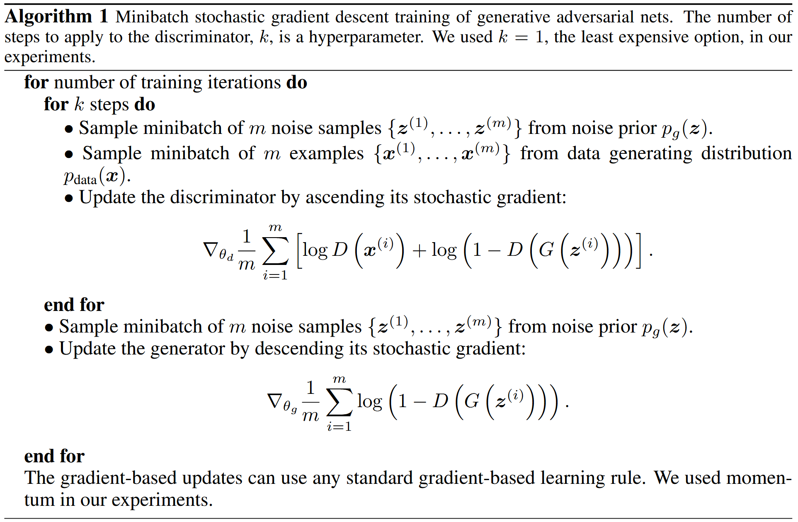
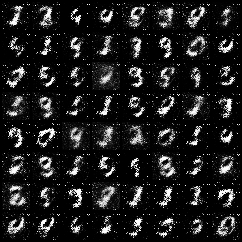

# Generative Adversarial Networks

> **Abstrct**: We propose a new framework for estimating generative models via an adversarial process, in which we **simultaneously train two models**: a generative model G that captures the data distribution, and a discriminative model D that estimates the probability that a sample came from the training data rather than G. The training procedure for G is to maximize the probability of D making a mistake. This framework corresponds to a minimax two-player game. In the space of arbitrary functions G and D, a unique solution exists, with G recovering the training data distribution and D equal to 1/2 everywhere. In the case where G and D are defined  by multilayer perceptrons, the entire system can be trained with backpropagation. There is no need for any Markov chains or unrolled approximate inference networks during either training or generation of samples. Experiments demonstrate the potential of the framework through qualitative and quantitative evaluation of the generated samples.

## Model Architecture
In this implementation, both Generator and Discriminator are defined as Multi Layer Perceptron with 4 hidden layers.
- ***Generator***: [affine - batchnorm - relu] x 4 - affine - sigmoid
- ***Discriminator***: [affine - leaky relu - dropout] x 3 - affine - tanh

## Training Details

| Hyper Parameter              | Default Value |
| ---------------------------- | ------------- |
| learning rate                | 0.0002        |
| betas                        | (0.5, 0.999)  |
| batch size                   | 64            |
| latent dimension             | 100           |
| number of epochs             | 100           |
| negative slope of Leaky ReLU | 0.2           |
| dropout ratio                | 0.3           |
| k                            | 1             |

I follow the training algorithm in original [Generative Adversarial Nets](https://arxiv.org/abs/1406.2661) paper. The details are described in the following picture.

## Results

| MNIST                        | FashionMNIST                               | CIFAR-10                         |
| ---------------------------- | ------------------------------------------ | -------------------------------- |
|  |  |  |

