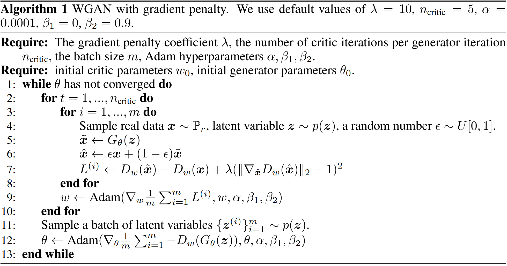
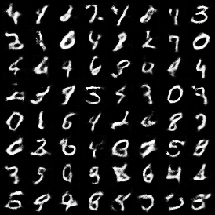
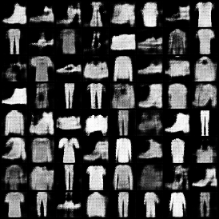
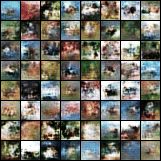

# Wasserstein GAN with Gradient Penalty

## Model Architecture

The model architecture is the same as WGAN, which is a variant of DCGAN.

- *Generator*: affine - [deconv - batchnorm - relu] x 3 - deconv -  tanh

- *Discriminator*: [conv - leaky relu] x 4 - affine

## Training Details

| Hyper Parameter                | Default Value |
| ------------------------------ | ------------- |
| learning rate                  | 0.0001        |
| batch size                     | 64            |
| number of generator iterations | 100000        |
| latent dimension               | 100           |
| number of critic               | 5             |
| gradient penalty coefficient   | 10            |
| betas(for Adam optimizer)      | (0, 0.9)      |

I follow the training algorithm in [WGAN-GP](http://arxiv.org/abs/1704.00028) paper.

## Results

| MNIST                        | FashionMNIST                               | CIFAR-10                         |
| ---------------------------- | ------------------------------------------ | -------------------------------- |
|  |  |  |

