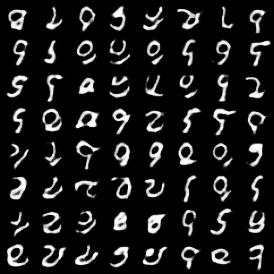

# Wasserstein GAN

## Model Architecture

The model architecture are very similar to DCGAN. The generator is the same as DCGAN. Besides, batchnorm is *NOT* applied in the discriminator for GAN stablity. So the architecture is:

- *Generator*: affine - [deconv - batchnorm - relu] x 3 - deconv -  tanh
- *Discriminator*: [conv - leaky relu] x 4 - affine

## Training Details

| Hyper Parameter                | Default Value |
| ------------------------------ | ------------- |
| learning rate                  | 0.00005       |
| batch size                     | 64            |
| latent dimension               | 100           |
| number of critic               | 5             |
| clip limit                     | 0.01          |
| number of generator iterations | 100000        |

I follow the training algorithm in [WGAN](http://arxiv.org/abs/1701.07875) paper.

## Results

| MNIST                        | FashionMNIST                               | CIFAR-10                         |
| ---------------------------- | ------------------------------------------ | -------------------------------- |
|  |  |  |

